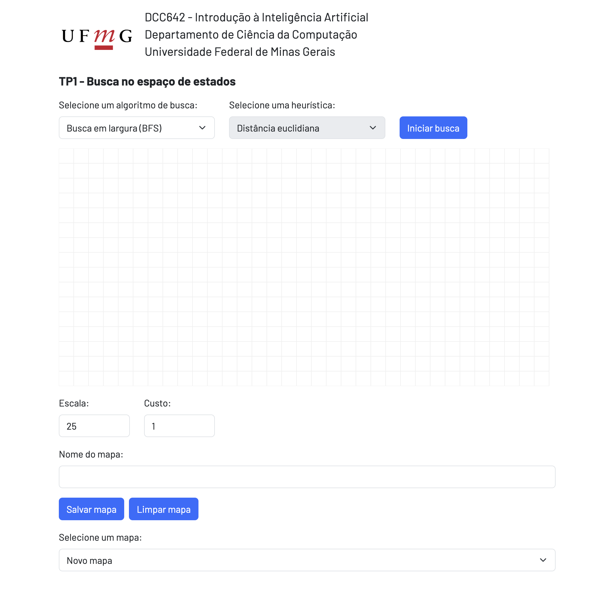

# Trabalho Prático - Introdução Inteligência Artificial

Projeto desenvolvido para disciplina Introdução à Inteligência Artificial na Universidade Federal de Minas Gerais (UFMG), semestre 2025/2.

## Contexto

Neste projeto, foram implementados em Python algoritmos de busca para encontrar o caminho mais curto em mapas com estrutura de grade. Através de uma página web conectada a um servidor local, é possível carregar mapas, criar novos exemplos e executar buscas com diferentes algoritmos e heurísticas. O objetivo é praticar a implementação de algoritmos de busca, analisar a exploração do espaço de estados e comparar desempenho em termos de custo, tamanho do caminho e nós visitados.

### Mapas

Os estados são representados por tuplas (x,y) com as coordenadas das células do mapa (grid). Além disso, cada estado tem um valor 1 <= v <= 9 associado, que será utilizado para calcular o custo das ações de movimentação no mapa. Segue um exemplo de mapa:

```
XXXXXXXXXXXXXXXX
XS1111111111111X
X11111111111111X
X11111111111111X
X11111111111111X
X11111111111111X
X1111111111111GX
XXXXXXXXXXXXXXXX
```

Os caracteres X representam paredes, S = (1,1) é o estado inicial e G = (13,6) é o estado final. Todos os outros caracteres numéricos representam espaços vazios. Neste exemplo, existem apenas espaços vazios com valor v = 1. Note que S e G também são espaços vazios (onde pode ocorrer movimento) e seus estados, por definição do problema, têm valor v = 1.

Podem ser feitos movimentos horizontais, verticais e diagonais.

O projeto inclui uma página web com servidor local para carregar mapas, executar buscas e visualizar resultados.

### Algoritmos implementados:

1. **Busca sem informação (uninformed search)**

     Esses algoritmos não usam heurística; exploram o espaço de estados de forma sistemática:

     - **BFS** (Busca em Largura / Breadth-First Search)
         - Explora os nós nível por nível.
         - Utiliza fila FIFO para a fronteira.
         - Garante encontrar o caminho mais curto em número de passos, se existir solução.

     - **DFS** (Busca em Profundidade / Depth-First Search)
         - Explora até o fim de um ramo antes de retroceder.
         - Utiliza pilha LIFO para a fronteira.
         - Pode visitar menos ou mais nós dependendo do mapa, mas não garante caminho mais curto.

     - **UCS** (Busca de Custo Uniforme / Uniform Cost Search)
         - Explora nós com base no menor custo acumulado até o momento.
         - Usa fila de prioridade (`heapq`).
         - Pode revisitar nós se encontrar caminho mais barato.

2. **Busca com informação (informed search / heuristic search)**

     Esses algoritmos usam heurísticas para guiar a busca:

     - **Euclidiana**: distância reta entre dois pontos.
     - **Manhattan**: soma das diferenças absolutas das coordenadas.

     - **Greedy (Busca Gulosa)**
         - Prioriza os nós com menor distância heurística até o objetivo.
         - Não considera custo real acumulado, apenas heurística.

     - **A Star**
         - Combina custo real `g(s)` e heurística `h(s)` na prioridade: `f(s) = g(s) + h(s)`.
         - Garante encontrar o caminho de menor custo se a heurística for admissível.
         - Também utiliza fila de prioridade (`heapq`).

## Estrutura do Projeto

| Arquivo | Descrição |
|---|---|
| `README.md` | Documentação do projeto |
| `editor_mapas.png` | Imagem do editor de mapas utilizado |
| `maps/` | Mapas de entrada gerais |
| `maps_basic/` | Mapas simples para teste de custo e transition_model |
| `performance_tests.py` | Scripts para comparar desempenho dos algoritmos |
| `requirements.txt` | Dependências do projeto |
| `search.py` | Implementação dos algoritmos de busca |
| `server.py` | Servidor web local para executar o projeto |
| `static/` | Arquivos estáticos do servidor (CSS, JS, imagens) |
| `templates/` | Templates HTML para a página web |
| `test_search.py` | Testes unitários para verificar os algoritmos |
| `relatorio.pdf` | Relatório contendo análise do desempenho dos algoritmos |

## Como executar o servidor

1. **Crie um ambiente virtual Python:**
    ```bash
    python -m venv tp1-env
    ```

2. **Ative o ambiente virtual:**
    ```bash
    source tp1-env/bin/activate
    ```

3. **Instale as dependências:**
    ```bash
    pip install -r requirements.txt
    ```

4. **Execute o servidor:**
    ```bash
    python server.py -port 5001
    ```

Assim que o servidor iniciar, abra o seguinte endereço em qualquer navegador: [http://localhost:5001](http://localhost:5001). Essa URL deverá mostrar a página ilustrada abaixo.
 


A grade é interativa e permite que você crie e modifique mapas para testar os algoritmos de busca. Por padrão, o mapa é uma grade vazia onde cada célula representa um espaço livre com custo 1. Você pode adicionar paredes, definir estados iniciais e finais e ajustar os custos das células. Aqui estão algumas instruções para usar a grade:

  - Clique em uma célula vazia para adicionar uma parede.
  - Clique em uma célula ocupada para removê-la.
  - Segure a tecla "s" e clique em uma célula para definir o estado inicial.
  - Segure a tecla "g" e clique em uma célula para definir o estado final.
  - Segure a tecla "c" e clique em uma célula para definir o custo.

Quando terminar de editar o mapa, você pode salvá-lo com um nome específico usando o campo "Nome do mapa" e o botão "Salvar mapa". Você também pode carregar mapas salvos anteriormente usando o menu suspenso "Selecione um mapa". Para executar um algoritmo clique no botão "Iniciar busca".

## Testes unitários

Para rodar os testes:

```bash
pytest -v test_search.py
```

Para ver os prints e logs durante os testes:

```bash
pytest -v -s test_search.py
```

## Performance

Executa todos os algoritmos de busca em um ou mais mapas e compara desempenho por custo, tamanho do caminho e nós visitados.

```bash
python performance_tests.py
```